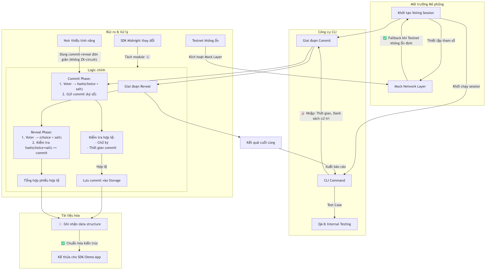

# Technical details

<figure><figcaption></figcaption></figure>

#### 📌 Giải thích Flow chính:

1. **Khởi tạo Session** (vote-cli + vote-test-env):
   * Nhập tham số qua CLI: thời gian commit/reveal, danh sách cử tri.
   * Mock Network kích hoạt nếu testnet gặp sự cố (giải quyết rủi ro #3).
2. **Giai đoạn Commit** (vote-core):
   * Cử tri tạo `hash(lựa chọn + salt)` và ký số.
   * Hệ thống kiểm tra tính hợp lệ (chữ ký, thời gian).
   * Lưu commit vào storage (dùng cho reveal sau).
3. **Giai đoạn Reveal** (vote-core):
   * Cử tri gửi lựa chọn thật + salt.
   * Kiểm tra khớp với commit đã lưu → Chỉ tính phiếu hợp lệ.
   * \*Lưu ý: Không dùng ZK-circuit phức tạp (giải quyết rủi ro #2).\*
4. **Tổng hợp & Tài liệu hóa**:
   * Kết quả được xuất ra vote-cli.
   * Mọi data structure và logic được ghi nhận trong vote-docs để tái sử dụng.

#### 🛡️ Xử lý rủi ro trong kiến trúc:

* **Module hóa** → Giảm phụ thuộc SDK (vote-core tách biệt với vote-test-env).
* **Mock Layer** → Test offline độc lập với testnet.
* **Phiên bản đơn giản** của commit-reveal → Tránh phụ thuộc tính năng Noir chưa hoàn thiện.

Flowchart này đảm bảo tính **minh bạch** (mọi bước kiểm tra rõ ràng), **bảo mật** (xác thực chữ ký, salt ngẫu nhiên), và **linh hoạt** (dễ mở rộng nhờ module hóa). Tài liệu kỹ thuật (vote-docs) sẽ ghi chép chi tiết từng bước để hỗ trợ phát triển SDK sau này.
